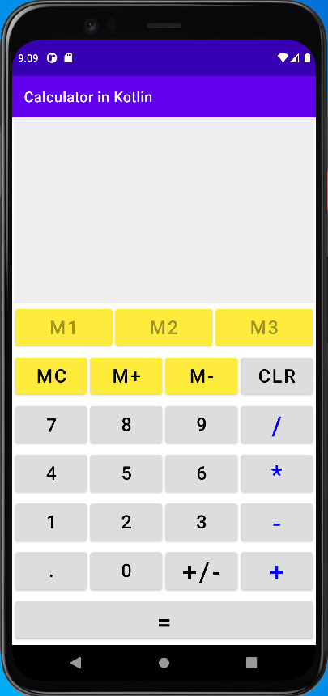

# Calculator in Kotlin

## Purpose: Learn Kotlin

### This program is referred to [tutorialsEU](https://www.youtube.com/watch?v=uRyvNKRkwbs). The big difference in UI is that I added the buttons: MC, M+, M-, and 3 save spaces for M+.

